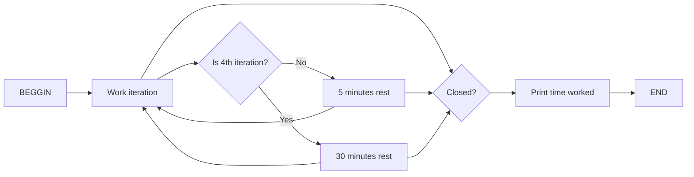

# Rest Alarm
Configurable CLI Alarm to remember to rest from the PC screen.

## Technologies used

- Node.js

```mermaid
  graph LR;
      B[BEGGIN] --> W
      W[Work iteration] --> RQ1{Is 4th iteration?}
      RQ1 --> |No| RA1[5 minutes rest]
      RA1 --> W
      RQ1 --> |Yes| RA2[30 minutes rest]
      RA2 --> W
      W --> RQ2{Closed?}
      RA1 --> RQ2
      RA2 --> RQ2
      RQ2 --> R[Print time worked]
      R --> E[END]      
```
